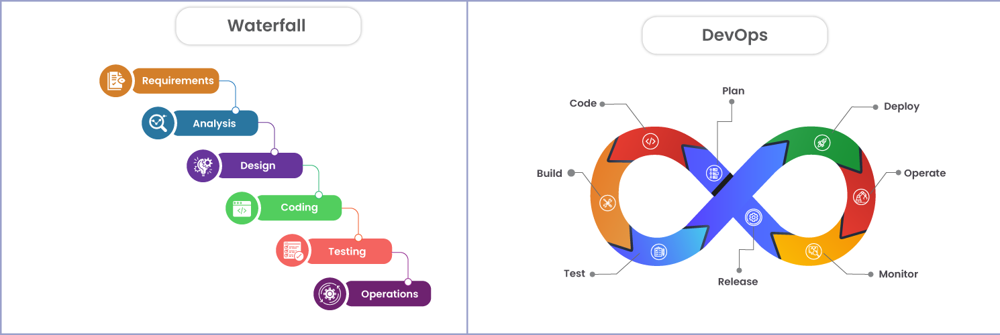
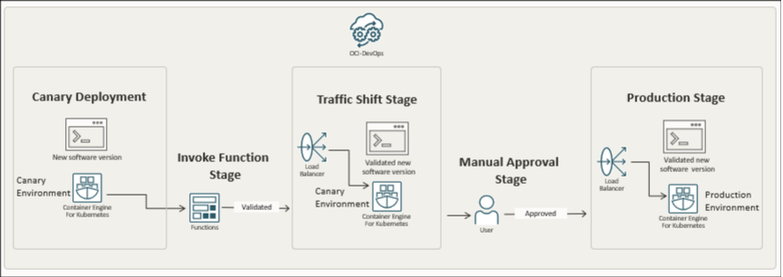

## DevOps vs. cascada tradicional
 
**Devops** permite un desarrollo más rápido y reduce el riesgo al crear proyectos para la nube debido a la trazabilidad y la automatización tanto de las pruebas como del despliegue que permiten detectar errores a tiempo y corregirlas sin bloquear el trabajo de los demás. Mientras tanto, el **desarrollo en cascada** no permite solucionar problemas o hacer nuevas implementaciones de forma rápida, se debe tener claro que funcionalidades tendrá el proyecto desde el inicio.
Un contexto real donde el desarrollo en cascada sigue siendo razonable podría ser el desarrollo de un sistema de control de vuelo ya que se requiere cumplir con ciertas normas regulatorias y es vital que en la entrega final no se encuentre ningún fallo. En dicho caso, se debe planificar con mucha antelación todo el sistema y cada paso, aunque tarde bastante tiempo, debe completarse con éxito y pasar todas las pruebas necesarias.
Algunos **criterios verificables** podrías ser:

- Cumplir con las normas de certificación aeronáutica
- Pasar todas las pruebas de simulación

Los **trade-offs** de aplicar desarrollo en cascada en este contexto serían:

- Se garantiza la seguridad y el cumplimiento de las normas internacionales
- El proceso de desarrollo es muy lento y costoso

## Ciclo tradicional de dos pasos y silos
 
### Limitaciones del ciclo "construcción -> operación"
- **Grandes lotes de cambios:** Al no haber integración continua, el software se construye en grandes bloques de código que no han sido probados minuciosamente y pueden contener errores difíciles de encontrar y solucionar.
- **Colas de defectos:** Los errores se encuentran hacia el final del desarrollo y resulta en un acumulado de defectos que pudieron detectarse antes.

### Antipatrones del desarrollo de software
- **"Throw over the wall":** Este antipatrón consiste en la falta de comunicación efectiva en un equipo de desarrollo. Esto incluye la falta de documentación en el código y la falta de contexto sobre los avances que se han realizado, simplemente se asume que los demás sabrán como hacer que el código funcione. Esta situación no solo retrasa el desarrollo del producto sino que impide la colaboración y aumenta el MTTR (tiempo promedio de reparación) ya que el equipo de operaciones no entiende como funciona el código de los desarrolladores, provocando que la resolución de errores en producción tome más tiempo.
- **Seguridad como auditoría tardía:** Este antipatrón consiste en comenzar a realizar pruebas y configuraciones de seguridad al final del desarrollo, en vez de hacerlo desde el inicio. Esto genera un alto costo de integración tardía ya que los errores de seguridad descubiertos tardíamente pueden implicar el rediseño de la infraestructura y alargar el tiempo de desarrollo.

## Principios y beneficios de DevOps (CI/CD, automatización, colaboración; Agile como precursor)

CI/CD consiste en la integración o fusión continua de los cambios en una rama del proyecto hacia la rama en producción y la implementación de pruebas automatizadas antes de cada fusión para garantizar que despliegue de la aplicación sea estable. Para ello se busca hacer cambios pequeños en lugar lotes de código grandes y hacer merge frecuentemente desde cada rama de desarrollo. Una de las prácticas más comúnes y frecuentes en DevOps es Agile. Parte de las prácticas de Agile incluyen reuniones diarias, dichas reuniones ayudan a que el equipo se mantenga en sincronía respecto a sus avances y de esa forma, tomar mejores decisiones sobre que features se deben bloquear o priorizar. También podemos mencionar las retrospectivas, reuniones periódicas que ayudan a reflexionar sobre los fallos en el desarrollo así como posibles mejoras.
Un indicador observable para medir la colaboración DevOps podría ser el tiempo promedio desde que se realiza un Pull Request hasta que se aprueba y sube a producción.

## Evolución a DevSecOps (seguridad desde el inicio: SAST/DAST; cambio cultural)

El **SAST** consiste en analizar el código fuente sin ejecutar el programa justo después de las pruebas unitarias para detectar fallos de seguridad de forma temprana. Por otro lado el **DAST** consiste en analizar el programa en ejecución mediante la simulación de ataques para encontrar fallos de seguridad justo antes del despliegue en producción con un entorno controlado.
Un **gate de seguridad mínimo** podría definirse con los siguientes umbrales:
- No se admite ningún fallo de seguridad crítico, de detectarse al menos uno se bloquea el despliegue a producción o al entorno de prueba.
- Las pruebas de seguridad deben cubrir por lo menos el 80% de las rutas de código.

En adición al **gate de seguridad** podemos crear una **política de excepción** que consista en dar un límite máximo de 15 días para resolver una excepción, para ello se debe crear un plan de corrección que incluya el tipo de riesgo, acciones de mitigación temporal y un plazo estimado para hallar una solución definitiva, esto a cargo del líder técnico backend.

## CI/CD y estrategias de despliegue (sandbox, canary, azul/verde)

En el caso de un microservicio de pago, utilizaría la estrategia de despliegue canary ya que los errores en el sistema de pagos generaría grandes pérdidas y es mejor minimizar dicho riesgo mientras se valida la integración de los cambios en el sistema de pagos con usuarios reales a través de métricas como tiempo de respuesta de la transacción o tasa de transacciones fallidas. Además, de haber algún fallo se redirige el tráfico a la versión estable de la aplicación.

| Riesgo                                                                 | Mitigación                                                                                           |
|------------------------------------------------------------------------|------------------------------------------------------------------------------------------------------|
| Duplicación de transacciones  | Pruebas automatizadas con escenarios de retry.    |
| Cobros incorrectos    | Test automatizados con datos simulados de múltiples divisas antes del despliegue.        |
| Interrupción en la pasarela de pagos externa (API de terceros falla con la nueva versión). | Monitoreo específico de llamadas externas y rollback inmediato si error rate > 30%.                   |
| Latencia alta en confirmación de pagos que afecta experiencia del cliente. | Medir métricas p95/p99 de tiempo de respuesta en el canario y bloquear la ampliación si supera los umbrales. |

**KPI Primario:** Tasa de errores 5XX (errores del lado del servidor) en transacciones de pago
**Umbrales numéricos** 
**Umbral de promoción:** Si la tasa de error es menor al 0.2% en la ventana observada.
**Umbral de abortado:** Si la tasa de error es mayor a 1% se hace rollback inmediato a la versión estable.
**Ventana de observación:** 30 minutos de tráfico real en el canario

Si el KPI técnico, en este caso la tasa de errores se mantiene, pero una métrica de producto como por ejemplo la tasa de conversión cae, ambas deben coexistir en el gate porque son complementarias. Si bien a nivel técnico el sistema funciona las KPI de producto nos permiten saber si el negocio esta funcionando como debe, puede ser que los nuevos cambios hayan afectado la experiencia de usuario y debido a eso la tasa de conversión disminuyó.

## Fundamentos prácticos sin comandos (evidencia mínima)

## Desafíos de DevOps y mitigaciones
