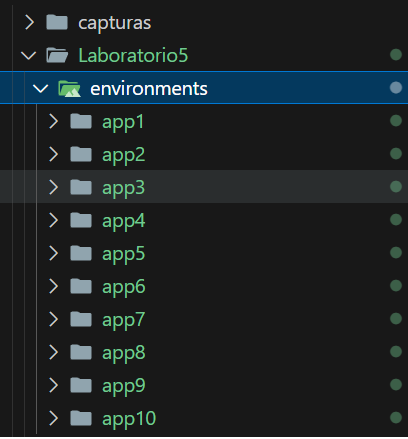
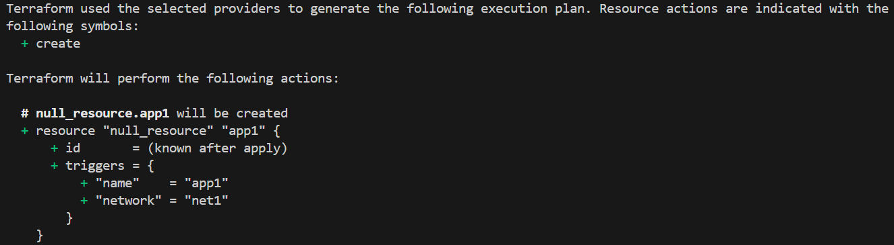
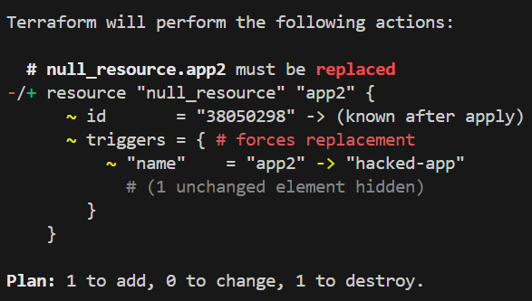

# Actividad: Escribiendo infraestructura como código en un entorno local con Terraform

## Fase 0: Preparación

Verficamos que podemos ejecutar lo siguiente:
```
python generate_envs.py
cd environments/app1
terraform init
```




## Fase 1: Expresando el cambio de infraestructura

Hacemos el siguiente cambio:

```
  "network": [
    {
-     "default": "net1",
+     "default": "lab-net",
      "description": "Nombre de la red local"
    }
  ]
```

Ejecutamos lo siguiente:

```
python generate_envs.py
cd environments/app1
terraform plan
```

Resultado:



## Fase 2: Entendiendo la inmutabilidad

Hacemos lo siguiente:

```
cd environments/app2
# edita manualmente main.tf.json: cambiar "name":"app2" ->"hacked-app"
```

Aplicamos lo siguiente

```
terraform plan
```

Resultado obtenido:




