## 1) HTTP: Fundamentos y herramientas

### 1. Levanta la app con variables de entorno
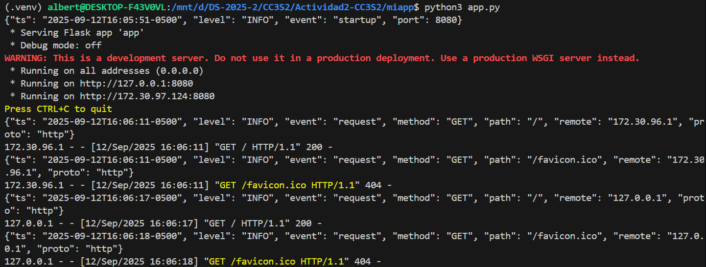

### 2. Inspección con curl
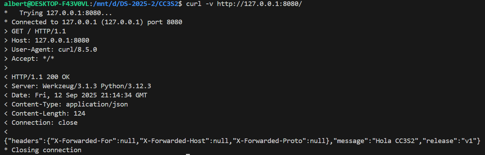
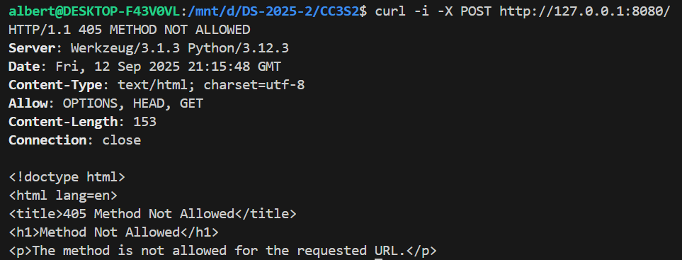
**¿Qué ocurre si no hay ruta/método?**
Si no se especifica la URL o el método aparece el mismo error indicando que no se ha especificado la **URL**

### 3. Puertos abiertos con ss
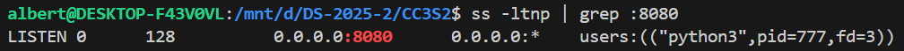

### 4. Logs como flujo

```
127.0.0.1 - - [12/Sep/2025 16:14:34] "GET / HTTP/1.1" 200 -
{"ts": "2025-09-12T16:15:48-0500", "level": "INFO", "event": "request", "method": "POST", "path": "/", "remote": "127.0.0.1", "pro127.0.0.1", "proto": "http"}
127.0.0.1 - - [12/Sep/2025 16:15:48] "POST / HTTP/1.1" 405 -
{"ts": "2025-09-12T16:24:22-0500", "level": "INFO", "event": "request", "method": "GET", "path": "/", "remote": "127.0.0.1", "prot27.0.0.1", "proto": "http"}
```

## 2) DNS: nombres, registros y caché

### 1. Host local
Usando el target de la guía **hosts-setup** para agregar ```127.0.0.1 miapp.local```
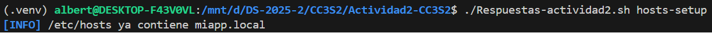

### 2. Comprueba resolución
```dig +short miapp.local```
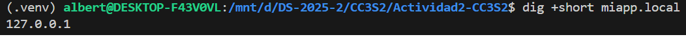
```getent hosts miapp.local```
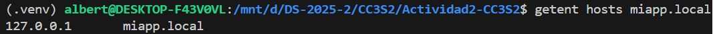

### 3. TTL/Caché (conceptual)
```dig example.com A +ttlunits```
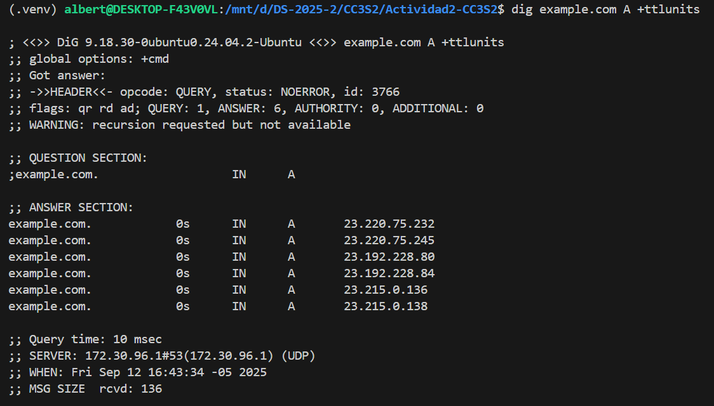


## 3) TLS: seguridad en tránsito con Nginx como reverse proxy

### 1. Certificado de laboratorio:
Usando el target ```tls-cert```
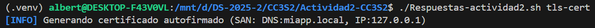


### 2. Configura Nginx
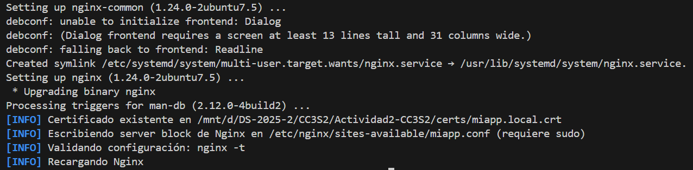

### 3. Valida el handshake
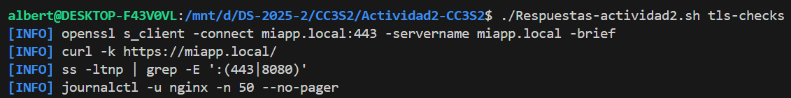

### 4. Puertos y logs
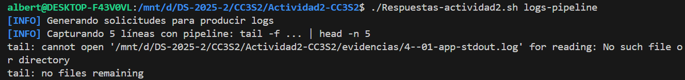
```
{"ts": "2025-09-14T20:04:34-0500", "level": "INFO", "event": "request", "method": "GET", "path": "/", "remote": "127.0.0.1", "proto": "http"}
127.0.0.1 - - [14/Sep/2025 20:04:34] "GET / HTTP/1.1" 200 -
{"ts": "2025-09-14T20:04:36-0500", "level": "INFO", "event": "request", "method": "GET", "path": "/", "remote": "127.0.0.1", "proto": "http"}
127.0.0.1 - - [14/Sep/2025 20:04:36] "GET / HTTP/1.1" 200 -
{"ts": "2025-09-14T20:04:38-0500", "level": "INFO", "event": "request", "method": "GET", "path": "/", "remote": "127.0.0.1", "proto": "http"}

```

## 4) 12-Factor App: port binding, configuración y logs
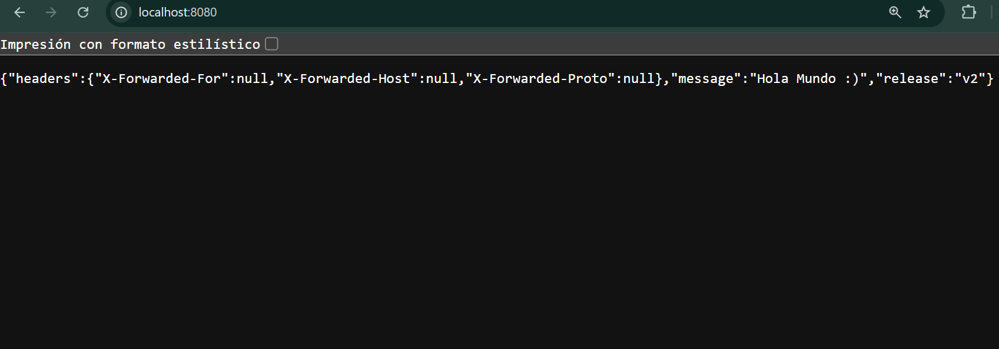

### 5) Operación reproducible (Make/WSL/Linux)

| Comando | Resultado esperado |
|---|---|
| `PORT=8080 MESSAGE="Hola CC3S2" RELEASE="v1" python3 app.py` | La app escucha en :8080, hace logs JSON a stdout y responde JSON con `message` y `release`. |
| `curl -v http://127.0.0.1:8080/` | Muestra solicitud/respuesta con cabeceras, código 200 y cuerpo JSON. |
| `curl -i -X POST http://127.0.0.1:8080/` | Devuelve 405 Method Not Allowed (la ruta '/' solo acepta GET). |
| `ss -ltnp | grep :8080` | Socket TCP en LISTEN con el PID del proceso Python. |
| `dig +short miapp.local` | Devuelve 127.0.0.1 (por entrada en /etc/hosts). |
| `getent hosts miapp.local` | Resolución vía NSS; muestra 127.0.0.1. |
| `openssl s_client -connect miapp.local:443 -servername miapp.local -brief` | Handshake TLSv1.2/1.3 con certificado autofirmado; SNI correcto. |
| `curl -k https://miapp.local/` | Respuesta 200 con JSON; `-k` omite validación de CA por ser autofirmado. |
| `journalctl -u nginx -n 50` | Últimas líneas del servicio Nginx (si systemd). |
| `tail -f evidencias/4--01-app-stdout.log | head -n 5` | Demuestra logs como flujo redirigible por pipeline. |


## Preguntas guía
**HTTP: explica idempotencia de métodos y su impacto en retries/health checks. Da un ejemplo con curl -X PUT vs POST.**

La idempotencia en HTTP significa que un método se puede ejecutar varias veces sin que cambie el resultado final. Esto es importante en los retries o en los health checks porque evita efectos indeseados: por ejemplo, un PUT para actualizar un recurso siempre lo reemplaza con el mismo valor aunque lo repitas, mientras que un POST creará un nuevo recurso cada vez que se ejecute.

**DNS: ¿por qué hosts es útil para laboratorio pero no para producción? ¿Cómo influye el TTL en latencia y uso de caché?**

El archivo hosts es útil porque permite mapear nombres a IPs de forma rápida sin depender de un servidor, pero en producción no sirve porque no escala ni se actualiza automáticamente.
Por otro lado, un TTL alto hace que las respuestas se guarden en caché por más tiempo reduciendo la latencia, pero si cambias la IP tardará en propagarse, mientras que un TTL bajo aumenta las consultas pero asegura que los cambios se vean casi de inmediato.

**TLS: ¿qué rol cumple SNI en el handshake y cómo lo demostraste con openssl s_client?**

El SNI permite que durante el handshake, el cliente le diga al servidor qué dominio está pidiendo, así el servidor devuelve el certificado correcto, sobre todo en un mismo servidor con varios sitios.

**12-Factor: ¿por qué logs a stdout y config por entorno simplifican contenedores y CI/CD?**

Los logs se mandan a stdout porque los contenedores pueden recoger esa salida fácilmente y redirigirla a sistemas de monitoreo, mientras que la configuración por variables de entorno simplifica el despliegue en CI/CD porque no tienes que modificar el código ni tener archivos distintos para cada entorno.

**Operación: ¿qué muestra ss -ltnp que no ves con curl? ¿Cómo triangulas problemas con journalctl/logs de Nginx?**

El comando ss -ltnp muestra puertos abiertos, procesos y sockets activos, información que curl no te da. Para diagnosticar problemas con Nginx, puedes revisar los logs del sistema con journalctl -u nginx para ver errores del servicio y luego revisar en profundidad los archivos generados.