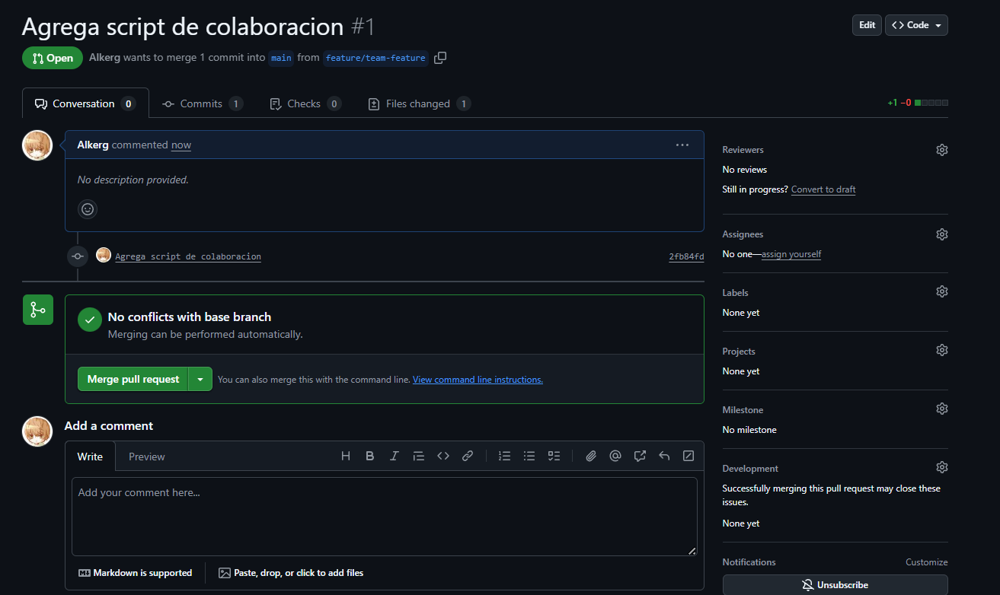
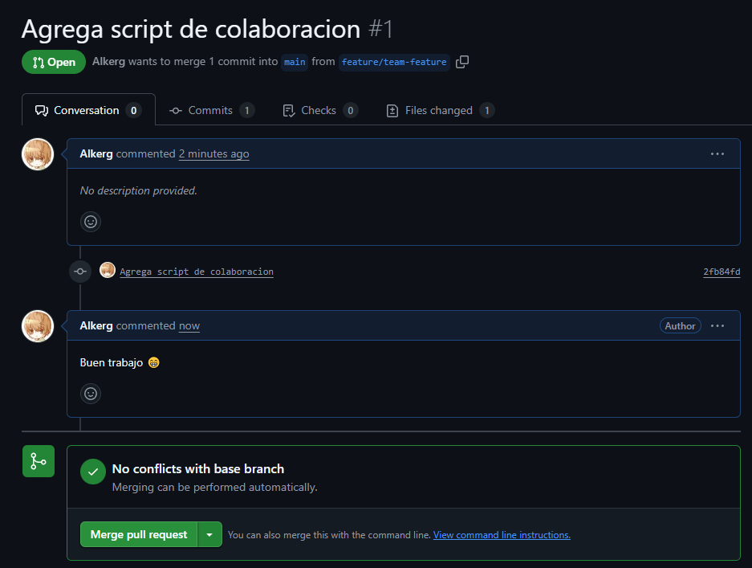

# Actividad 6: Introducción a Git conceptos básicos y operaciones esenciales

## git config: Preséntate a Git

Ahora, hay algo que debes hacer antes de comenzar un proyecto. Preséntate a Git. Para presentarte a Git, usa el comando git config:

```
Albert@DESKTOP-F43V0VL MINGW64 /d/DS-2025-2/CC3S2/Actividad6-CC3S2 (main)
$ git config --global user.name
Alkerg

Albert@DESKTOP-F43V0VL MINGW64 /d/DS-2025-2/CC3S2/Actividad6-CC3S2 (main)
$ git config --global user.email
albert.arg500@gmail.com
```

## git init: Donde comienza tu viaje de código

Al igual que cada gran viaje tiene su origen, en el mundo de Git, el viaje de tu código comienza con el comando git init. El comando se usa para inicializar un nuevo repositorio de Git y comenzar a rastrear directorios existentes. Cuando ejecutas el comando, configura un directorio .git lleno de todo lo necesario para el control de versiones.

```

Albert@DESKTOP-F43V0VL MINGW64 /d/DS-2025-2/test-repo
$ git init
Initialized empty Git repository in D:/DS-2025-2/test-repo/.git/
```

## git add: Preparando tu código

El comando git add es tu puente entre hacer cambios en tu directorio de trabajo y prepararlos para ser almacenados permanentemente en tu repositorio de Git.

```
Albert@DESKTOP-F43V0VL MINGW64 /d/DS-2025-2/test-repo (main)
$ echo " README" > README.md

Albert@DESKTOP-F43V0VL MINGW64 /d/DS-2025-2/test-repo (main)
$ git status
On branch main

No commits yet

Untracked files:
  (use "git add <file>..." to include in what will be committed)
        README.md

nothing added to commit but untracked files present (use "git add" to track)

```

```
Albert@DESKTOP-F43V0VL MINGW64 /d/DS-2025-2/test-repo (main)
$ git add README.md

Albert@DESKTOP-F43V0VL MINGW64 /d/DS-2025-2/test-repo (main)
$ git status
On branch main

No commits yet

Changes to be committed:
  (use "git rm --cached <file>..." to unstage)
        new file:   README.md

```

## git commit: registra cambios

El comando git commit registra los cambios que has preparado con git add en el historial del repositorio. Esto te permite rastrear cambios a lo largo del tiempo.

```
Albert@DESKTOP-F43V0VL MINGW64 /d/DS-2025-2/test-repo (main)
$ git commit -m "Commit inicial con README.md"
[main (root-commit) 41ab400] Commit inicial con README.md
 1 file changed, 1 insertion(+)
 create mode 100644 README.md

Albert@DESKTOP-F43V0VL MINGW64 /d/DS-2025-2/test-repo (main)
$ git status
On branch main
nothing to commit, working tree clean
```

## git log: Recorrer el árbol de commits

Una vez que hayas realizado algunos commits, es posible que desees retroceder y ver el historial de cambios realizados en el repositorio. Aquí es donde el comando git log resulta útil. El comando muestra una lista de commits realizados es un repositorio en orden cronológico inverso, es decir, el commit más reciente se muestra primero.

```
Albert@DESKTOP-F43V0VL MINGW64 /d/DS-2025-2/test-repo (main)
$ git log
commit 41ab4008ce427b16a8d519d78bc49986db794b04 (HEAD -> main)
Author: Alkerg <albert.arg500@gmail.com>
Date:   Fri Sep 26 22:08:22 2025 -0500

    Commit inicial con README.md

Albert@DESKTOP-F43V0VL MINGW64 /d/DS-2025-2/test-repo (main)
$ git log --graph --pretty=format:'%x09 %h %ar ("%an") %s'
*        41ab400 2 minutes ago ("Alkerg") Commit inicial con README.md

```

```
Albert@DESKTOP-F43V0VL MINGW64 /d/DS-2025-2/test-repo (main)
$ echo " CONTRIBUTING" > CONTRIBUTING.md

Albert@DESKTOP-F43V0VL MINGW64 /d/DS-2025-2/test-repo (main)
$ echo " README\n\nBienvenido al proyecto" > README.md

Albert@DESKTOP-F43V0VL MINGW64 /d/DS-2025-2/test-repo (main)
$ git add .

Albert@DESKTOP-F43V0VL MINGW64 /d/DS-2025-2/test-repo (main)
$ git commit -m "Configura la documentación base del repositorio"
[main 1d0663d] Configura la documentación base del repositorio
 2 files changed, 2 insertions(+), 1 deletion(-)
 create mode 100644 CONTRIBUTING.md

Albert@DESKTOP-F43V0VL MINGW64 /d/DS-2025-2/test-repo (main)
$ echo "print('Hello World')" > main.py

Albert@DESKTOP-F43V0VL MINGW64 /d/DS-2025-2/test-repo (main)
$ git add .

Albert@DESKTOP-F43V0VL MINGW64 /d/DS-2025-2/test-repo (main)
$ git commit -m "Agrega main.py"
[main 4dfb704] Agrega main.py
 1 file changed, 1 insertion(+)
 create mode 100644 main.py
```

```
Albert@DESKTOP-F43V0VL MINGW64 /d/DS-2025-2/test-repo (main)
$  git log --oneline
4dfb704 (HEAD -> main) Agrega main.py
1d0663d Configura la documentación base del repositorio
41ab400 Commit inicial con README.md
```

# Trabajar con ramas: La piedra angular de la colaboración

## git branch: Entendiendo los conceptos básicos de Git branch

Cuando inicializas un repositorio de Git, automáticamente crea una rama (branch) predeterminada, generalmente llamada main (anteriormente conocida como master). Cuando ejecutas el comando git branch, mostrará la lista de todas las ramas en tu repositorio, con la branch actual destacada:

```
Albert@DESKTOP-F43V0VL MINGW64 /d/DS-2025-2/test-repo (main)
$ git branch
* main
```

## git checkout/git switch: Cambiar entre ramas

En tu flujo de trabajo diario, a menudo necesitarás cambiar de una rama a otra, especialmente cuando trabajas en múltiples características o corrigiendo errores. Cuando hayas comenzado a trabajar en múltiples ramas, volverse consciente de la branch en la que estás activamente se vuelve fundamental. En Git, el término HEAD se refiere a la punta de la rama con la que estás trabajando activamente.


```
Albert@DESKTOP-F43V0VL MINGW64 /d/DS-2025-2/test-repo (main)
$ git branch feature/new-feature

Albert@DESKTOP-F43V0VL MINGW64 /d/DS-2025-2/test-repo (main)
$ git checkout feature/new-feature
Switched to branch 'feature/new-feature'
```

```
Albert@DESKTOP-F43V0VL MINGW64 /d/DS-2025-2/test-repo (feature/new-feature)
$ git branch
* feature/new-feature
  main

Albert@DESKTOP-F43V0VL MINGW64 /d/DS-2025-2/test-repo (develop)
$ git branch feature/login develop

Albert@DESKTOP-F43V0VL MINGW64 /d/DS-2025-2/test-repo (develop)
$ git checkout feature/login
Switched to branch 'feature/login'

Albert@DESKTOP-F43V0VL MINGW64 /d/DS-2025-2/test-repo (feature/login)
$ git log --oneline
4dfb704 (HEAD -> feature/login, main, feature/new-feature, develop) Agrega main.py
1d0663d Configura la documentación base del repositorio
41ab400 Commit inicial con README.md

```
## git merge : Fusionando ramas

Una vez que hayas realizado cambios en una rama y los hayas probado a fondo, es posible que desees integrar esos cambios nuevamente en la branch main u otra rama. Esta operación se conoce como merge (fusión):

```
Albert@DESKTOP-F43V0VL MINGW64 /d/DS-2025-2/test-repo (feature/another-new-feature)
$ git checkout main
Switched to branch 'main'

Albert@DESKTOP-F43V0VL MINGW64 /d/DS-2025-2/test-repo (main)
$ git merge feature/new-feature
Already up to date.
```

## git branch -d: Eliminando una rama

Una vez que una rama ha sido fusionada con éxito y ya no es necesaria, se puede eliminar para mantener limpio el repositorio:

```
Albert@DESKTOP-F43V0VL MINGW64 /d/DS-2025-2/test-repo (main)
$ git branch -d feature/new-feature
Deleted branch feature/new-feature (was 4dfb704).
```

## Preguntas

- **¿Cómo te ha ayudado Git a mantener un historial claro y organizado de tus cambios?**
Git me ha ayudado a mantener un historial claro mediante funciones como ```log``` y sus diferentes parámetros que me permiten ver la evolución del proyecto a través de los commits.
- **¿Qué beneficios ves en el uso de ramas para desarrollar nuevas características o corregir errores?**
El principal beneficio del uso de ramas es permitir la colaboración de varios desarrolladores sobre la misma base de código donde cada uno puede trabajar en una característica diferente sin modificar el código base al mismo tiempo hasta que llega el momento de integrar los cambios.
- **Realiza una revisión final del historial de commits para asegurarte de que todos los cambios se han registrado correctamente.**
- **Revisa el uso de ramas y merges para ver cómo Git maneja múltiples líneas de desarrollo.**

## Ejercicios

### Ejercicio 1: Manejo avanzado de ramas y resolución de conflictos

1. Crear una nueva rama para una característica:
```
Albert@DESKTOP-F43V0VL MINGW64 /d/DS-2025-2/test-repo (main)
$ git branch feature/advanced-feature

Albert@DESKTOP-F43V0VL MINGW64 /d/DS-2025-2/test-repo (main)
$ git checkout feature/advanced-feature
Switched to branch 'feature/advanced-feature'
```

2. Modificar archivos en la nueva rama:
```
def greet():
    print('Hello como una función avanzada')

greet()

Albert@DESKTOP-F43V0VL MINGW64 /d/DS-2025-2/test-repo (feature/advanced-feature)
$ git add main.py

Albert@DESKTOP-F43V0VL MINGW64 /d/DS-2025-2/test-repo (feature/advanced-feature)
$ git commit -m "Agrega la función grret como función avanzada"
[feature/advanced-feature 84ac2dc] Agrega la función grret como función avanzada
 1 file changed, 5 insertions(+)
```

3. Simular un desarrollo paralelo en la rama main:
```
Albert@DESKTOP-F43V0VL MINGW64 /d/DS-2025-2/test-repo (feature/advanced-feature)
$ git checkout main
Switched to branch 'main'

Albert@DESKTOP-F43V0VL MINGW64 /d/DS-2025-2/test-repo (main)
$ git add main.py

Albert@DESKTOP-F43V0VL MINGW64 /d/DS-2025-2/test-repo (main)
$ git commit -m "Actualizar el mensaje main.py en la rama main"
[main 1983c47] Actualizar el mensaje main.py en la rama main
 1 file changed, 1 insertion(+), 1 deletion(-)
```

4. Intentar fusionar la rama feature/advanced-feature en main:
```
Albert@DESKTOP-F43V0VL MINGW64 /d/DS-2025-2/test-repo (main)
$ git merge feature/advanced-feature
Auto-merging main.py
CONFLICT (content): Merge conflict in main.py
Automatic merge failed; fix conflicts and then commit the result.
```

5. Resolver el conflicto de fusión:

```
Albert@DESKTOP-F43V0VL MINGW64 /d/DS-2025-2/test-repo (main|MERGING)
$ git add main.py

Albert@DESKTOP-F43V0VL MINGW64 /d/DS-2025-2/test-repo (main|MERGING)
$ git commit -m "Resuelve el conflicto de fusión entre la versión main y feature/advanced-feature"
[main d7aa6ff] Resuelve el conflicto de fusión entre la versión main y feature/advanced-feature
```

6. Eliminar la rama fusionada:

```
Albert@DESKTOP-F43V0VL MINGW64 /d/DS-2025-2/test-repo (main)
$ git branch -d feature/advanced-feature
Deleted branch feature/advanced-feature (was 84ac2dc).
```

### Ejercicio 2: Exploración y manipulación del historial de commits

1. Ver el historial detallado de commits:

```
Albert@DESKTOP-F43V0VL MINGW64 /d/DS-2025-2/test-repo (main)
$ git log -p
commit d7aa6ff8bdeda926f5f5a57d59838ba2c39a09d8 (HEAD -> main)
Merge: 1983c47 84ac2dc
Author: Alkerg <albert.arg500@gmail.com>
Date:   Fri Sep 26 23:51:44 2025 -0500

    Resuelve el conflicto de fusión entre la versión main y feature/advanced-feature

commit 1983c47a6c80f19124efdaa88fc894ed09263c56
Author: Alkerg <albert.arg500@gmail.com>
Date:   Fri Sep 26 23:49:13 2025 -0500

    Actualizar el mensaje main.py en la rama main

diff --git a/main.py b/main.py
index df1dc68..de168c1 100644
--- a/main.py
+++ b/main.py
@@ -1 +1 @@
-print('Hello World')
+print('Hello World-actualiado en main')

commit 84ac2dc2cf02c25210d77bd94408ec499877c2ef
Author: Alkerg <albert.arg500@gmail.com>
Date:   Fri Sep 26 23:43:52 2025 -0500

    Agrega la función grret como función avanzada

diff --git a/main.py b/main.py
index df1dc68..629abaf 100644
--- a/main.py
+++ b/main.py
@@ -1 +1,6 @@
 print('Hello World')
+
+def greet():
+    print('Hello como una función avanzada')
+
+greet()
\ No newline at end of file

commit 4dfb7046f86dbe59b1ff03e8d437b2f54e011ff6 (feature/login, feature/another-new-feature, develop)
Author: Alkerg <albert.arg500@gmail.com>
Date:   Fri Sep 26 22:13:04 2025 -0500

    Agrega main.py

diff --git a/main.py b/main.py
new file mode 100644
index 0000000..df1dc68
--- /dev/null
+++ b/main.py
@@ -0,0 +1 @@
+print('Hello World')

commit 1d0663defc3591e5aa6a2c365e2c249b53988f32
Author: Alkerg <albert.arg500@gmail.com>
Date:   Fri Sep 26 22:12:06 2025 -0500

    Configura la documentación base del repositorio

diff --git a/CONTRIBUTING.md b/CONTRIBUTING.md
new file mode 100644
index 0000000..2e8cc63
--- /dev/null
+++ b/CONTRIBUTING.md
@@ -0,0 +1 @@
+ CONTRIBUTING
diff --git a/README.md b/README.md
index 2772834..e3ff6c4 100644
--- a/README.md
+++ b/README.md
@@ -1 +1 @@
- README
+ README\n\nBienvenido al proyecto

commit 41ab4008ce427b16a8d519d78bc49986db794b04
Author: Alkerg <albert.arg500@gmail.com>
Date:   Fri Sep 26 22:08:22 2025 -0500

    Commit inicial con README.md

diff --git a/README.md b/README.md
new file mode 100644
index 0000000..2772834
--- /dev/null
+++ b/README.md
@@ -0,0 +1 @@
+ README

```

2. Filtrar commits por autor:

```
commit d7aa6ff8bdeda926f5f5a57d59838ba2c39a09d8 (HEAD -> main)
Merge: 1983c47 84ac2dc
Author: Alkerg <albert.arg500@gmail.com>
Date:   Fri Sep 26 23:51:44 2025 -0500

    Resuelve el conflicto de fusión entre la versión main y feature/advanced-feature

commit 1983c47a6c80f19124efdaa88fc894ed09263c56
Author: Alkerg <albert.arg500@gmail.com>
Date:   Fri Sep 26 23:49:13 2025 -0500

    Actualizar el mensaje main.py en la rama main

commit 84ac2dc2cf02c25210d77bd94408ec499877c2ef
Author: Alkerg <albert.arg500@gmail.com>
Date:   Fri Sep 26 23:43:52 2025 -0500

    Agrega la función grret como función avanzada

commit 4dfb7046f86dbe59b1ff03e8d437b2f54e011ff6 (feature/login, feature/another-new-feature, develop)
Author: Alkerg <albert.arg500@gmail.com>

```

3. Revertir un commit:

```
Albert@DESKTOP-F43V0VL MINGW64 /d/DS-2025-2/test-repo (main)
$ git revert HEAD
[main 82ba104] Revert "agregando mensaje nuevo"
 1 file changed, 2 deletions(-)
```

4. Rebase interactivo:

```
Albert@DESKTOP-F43V0VL MINGW64 /d/DS-2025-2/test-repo (main)
$ git rebase -i HEAD~3
[detached HEAD a2fc9f0] commit 2
 Date: Sat Sep 27 00:26:15 2025 -0500
 1 file changed, 4 insertions(+), 1 deletion(-)
Successfully rebased and updated refs/heads/main.
```

5. Visualización gráfica del historial:

```
Albert@DESKTOP-F43V0VL MINGW64 /d/DS-2025-2/test-repo (main)
$ git log --graph --oneline --all
* a2fc9f0 (HEAD -> main) commit 2
* 458f29c commit 1
* 82ba104 Revert "agregando mensaje nuevo"
* 5509c72 agregando mensaje nuevo
*   d7aa6ff Resuelve el conflicto de fusión entre la versión main y feature/advanced-feature
|\
| * 84ac2dc Agrega la función grret como función avanzada
* | 1983c47 Actualizar el mensaje main.py en la rama main
|/
* 4dfb704 (feature/login, feature/another-new-feature, develop) Agrega main.py
* 1d0663d Configura la documentación base del repositorio
* 41ab400 Commit inicial con README.md
```

### Ejercicio 3: Creación y gestión de ramas desde commits específicos

1. Crear una nueva rama desde un commit específico:

```
Albert@DESKTOP-F43V0VL MINGW64 /d/DS-2025-2/test-repo (main)
$ git log --oneline
a2fc9f0 (HEAD -> main) commit 2
458f29c commit 1
82ba104 Revert "agregando mensaje nuevo"
5509c72 agregando mensaje nuevo
d7aa6ff Resuelve el conflicto de fusión entre la versión main y feature/advanced-feature
1983c47 Actualizar el mensaje main.py en la rama main
84ac2dc Agrega la función grret como función avanzada
4dfb704 (feature/login, feature/another-new-feature, develop) Agrega main.py
1d0663d Configura la documentación base del repositorio
41ab400 Commit inicial con README.md
```

2. Modificar y confirmar cambios en la nueva rama:

```
Albert@DESKTOP-F43V0VL MINGW64 /d/DS-2025-2/test-repo (main)
$ git branch bugfix/rollback-feature 5509c72

Albert@DESKTOP-F43V0VL MINGW64 /d/DS-2025-2/test-repo (main)
$ git checkout bugfix/rollback-feature
Switched to branch 'bugfix/rollback-feature'

Albert@DESKTOP-F43V0VL MINGW64 /d/DS-2025-2/test-repo (bugfix/rollback-feature)
$ git add .

Albert@DESKTOP-F43V0VL MINGW64 /d/DS-2025-2/test-repo (bugfix/rollback-feature)
$ git commit -m "Corregir error en la funcionalidad de rollback"
[bugfix/rollback-feature b1ef1b8] Corregir error en la funcionalidad de rollback
 1 file changed, 1 insertion(+), 1 deletion(-)

```

3. Fusionar los cambios en la rama principal:

```
Albert@DESKTOP-F43V0VL MINGW64 /d/DS-2025-2/test-repo (bugfix/rollback-feature)
$ git checkout main
Switched to branch 'main'

Albert@DESKTOP-F43V0VL MINGW64 /d/DS-2025-2/test-repo (main)
$ git merge bugfix/rollback-feature
Auto-merging main.py
Merge made by the 'ort' strategy.
 main.py | 2 +-
 1 file changed, 1 insertion(+), 1 deletion(-)
```

4. Explorar el historial después de la fusión:

```
Albert@DESKTOP-F43V0VL MINGW64 /d/DS-2025-2/test-repo (main)
$ git log --graph --oneline
*   bd4f35d (HEAD -> main) Merge branch 'bugfix/rollback-feature'
|\
| * b1ef1b8 (bugfix/rollback-feature) Corregir error en la funcionalidad de rollback
* | a2fc9f0 commit 2
* | 458f29c commit 1
* | 82ba104 Revert "agregando mensaje nuevo"
|/
* 5509c72 agregando mensaje nuevo
*   d7aa6ff Resuelve el conflicto de fusión entre la versión main y feature/advanced-feature
|\
| * 84ac2dc Agrega la función grret como función avanzada
* | 1983c47 Actualizar el mensaje main.py en la rama main
|/
* 4dfb704 (feature/login, feature/another-new-feature, develop) Agrega main.py
* 1d0663d Configura la documentación base del repositorio
* 41ab400 Commit inicial con README.md
```

5. Eliminar la rama bugfix/rollback-feature:

```
Albert@DESKTOP-F43V0VL MINGW64 /d/DS-2025-2/test-repo (main)
$ git branch -d bugfix/rollback-feature
Deleted branch bugfix/rollback-feature (was b1ef1b8).
```

### Ejercicio 4: Manipulación y restauración de commits con git reset y git restore

1. Hacer cambios en el archivo main.py:

```
print('Este cambio se restablecerá')

Albert@DESKTOP-F43V0VL MINGW64 /d/DS-2025-2/test-repo (main)
$ git add main.py

Albert@DESKTOP-F43V0VL MINGW64 /d/DS-2025-2/test-repo (main)
$ git commit -m "Introduce un cambio para restablecer"
[main adb19a0] Introduce un cambio para restablecer
 1 file changed, 3 insertions(+), 1 deletion(-)

```

2. Usar git reset para deshacer el commit:

```
Albert@DESKTOP-F43V0VL MINGW64 /d/DS-2025-2/test-repo (main)
$ git reset --hard HEAD~1
HEAD is now at bd4f35d Merge branch 'bugfix/rollback-feature'
```

3. Usar git restore para deshacer cambios no confirmados:

```
Albert@DESKTOP-F43V0VL MINGW64 /d/DS-2025-2/test-repo (main)
$ echo "Agrega linea en README" >> README.md

Albert@DESKTOP-F43V0VL MINGW64 /d/DS-2025-2/test-repo (main)
$ git status
On branch main
Changes not staged for commit:
  (use "git add <file>..." to update what will be committed)
  (use "git restore <file>..." to discard changes in working directory)
        modified:   README.md

no changes added to commit (use "git add" and/or "git commit -a")
```

```
Albert@DESKTOP-F43V0VL MINGW64 /d/DS-2025-2/test-repo (main)
$ git restore README.md

Albert@DESKTOP-F43V0VL MINGW64 /d/DS-2025-2/test-repo (main)
$ git status
On branch main
nothing to commit, working tree clean
```

### Ejercicio 5: Trabajo colaborativo y manejo de Pull Requests

1. Crear un nuevo repositorio remoto:

```
Albert@DESKTOP-F43V0VL MINGW64 /d/DS-2025-2
$ git clone git@github.com:Alkerg/new_repo.git
Cloning into 'new_repo'...
remote: Enumerating objects: 3, done.
remote: Counting objects: 100% (3/3), done.
remote: Total 3 (delta 0), reused 0 (delta 0), pack-reused 0 (from 0)
Receiving objects: 100% (3/3), done.
```

2. Crear una nueva rama para desarrollo de una característica:

```
Albert@DESKTOP-F43V0VL MINGW64 /d/DS-2025-2/new_repo (main)
$ git branch feature/team-feature

Albert@DESKTOP-F43V0VL MINGW64 /d/DS-2025-2/new_repo (main)
$ git checkout feature/team-feature
Switched to branch 'feature/team-feature'
```

3. Realizar cambios y enviar la rama al repositorio remoto:

```
Albert@DESKTOP-F43V0VL MINGW64 /d/DS-2025-2/new_repo (feature/team-feature)
$ git add .

Albert@DESKTOP-F43V0VL MINGW64 /d/DS-2025-2/new_repo (feature/team-feature)
$ git commit -m "Agrega script de colaboracion"
[feature/team-feature 2fb84fd] Agrega script de colaboracion
 1 file changed, 1 insertion(+)
 create mode 100644 colaboracion.py
```

```
Albert@DESKTOP-F43V0VL MINGW64 /d/DS-2025-2/new_repo (feature/team-feature)
$ git push origin feature/team-feature
Enumerating objects: 4, done.
Counting objects: 100% (4/4), done.
Delta compression using up to 12 threads
Compressing objects: 100% (2/2), done.
Writing objects: 100% (3/3), 323 bytes | 323.00 KiB/s, done.
Total 3 (delta 0), reused 0 (delta 0), pack-reused 0
remote:
remote: Create a pull request for 'feature/team-feature' on GitHub by visiting:
remote:      https://github.com/Alkerg/new_repo/pull/new/feature/team-feature
remote:
To github.com:Alkerg/new_repo.git
 * [new branch]      feature/team-feature -> feature/team-feature
```

4. Abrir un Pull Request:



5. Revisar y fusionar el Pull Request:




6. Eliminar la rama remota y local:

```
Albert@DESKTOP-F43V0VL MINGW64 /d/DS-2025-2/new_repo (main)
$ git branch -d feature/team-feature
Deleted branch feature/team-feature (was 2fb84fd).

Albert@DESKTOP-F43V0VL MINGW64 /d/DS-2025-2/new_repo (main)
$ git push origin --delete feature/team-feature
To github.com:Alkerg/new_repo.git
 - [deleted]         feature/team-feature

```

### Ejercicio 6: Cherry-Picking y Git Stash


1. Hacer cambios en main.py y confirmarlos:

```
Albert@DESKTOP-F43V0VL MINGW64 /d/DS-2025-2/new_repo (main)
$ git add main.py

Albert@DESKTOP-F43V0VL MINGW64 /d/DS-2025-2/new_repo (main)
$ git commit -m "Agrega ejemplo de cherry-pick"
[main e76c10e] Agrega ejemplo de cherry-pick
 1 file changed, 1 insertion(+)
 create mode 100644 main.py
```

2. Crear una nueva rama y aplicar el commit específico:

```
Albert@DESKTOP-F43V0VL MINGW64 /d/DS-2025-2/new_repo (main)
$ git branch feature/cherry-pick

Albert@DESKTOP-F43V0VL MINGW64 /d/DS-2025-2/new_repo (main)
$ git checkout feature/cherry-pick
Switched to branch 'feature/cherry-pick'

Albert@DESKTOP-F43V0VL MINGW64 /d/DS-2025-2/new_repo (feature/cherry-pick)
$ git cherry-pick 0fe2a9f45ec86f32c7fbcd02cc01cacf4b158e95
[feature/cherry-pick 9759222] Añadir file con mensaje
 Date: Sat Sep 27 01:08:12 2025 -0500
 1 file changed, 1 insertion(+)
 create mode 100644 file.py
```

3. Guardar temporalmente cambios no confirmados:

```
Albert@DESKTOP-F43V0VL MINGW64 /d/DS-2025-2/new_repo (feature/cherry-pick)
$ git status
On branch feature/cherry-pick
Changes not staged for commit:
  (use "git add <file>..." to update what will be committed)
  (use "git restore <file>..." to discard changes in working directory)
        modified:   main.py

no changes added to commit (use "git add" and/or "git commit -a")
```

```
Albert@DESKTOP-F43V0VL MINGW64 /d/DS-2025-2/new_repo (feature/cherry-pick)
$ git stash
warning: in the working copy of 'main.py', CRLF will be replaced by LF the next time Git touches it
Saved working directory and index state WIP on feature/cherry-pick: 9759222 Añadir file con mensaje
```

4. Aplicar los cambios guardados:

```
Albert@DESKTOP-F43V0VL MINGW64 /d/DS-2025-2/new_repo (feature/cherry-pick)
$ git add .
warning: in the working copy of 'file.py', CRLF will be replaced by LF the next time Git touches it
warning: in the working copy of 'main.py', CRLF will be replaced by LF the next time Git touches it

Albert@DESKTOP-F43V0VL MINGW64 /d/DS-2025-2/new_repo (feature/cherry-pick)
$ git commit -m "Añadir otros cambios en main y file"
[feature/cherry-pick e239da5] Añadir otros cambios en main y file
 2 files changed, 20 insertions(+), 2 deletions(-)
```

```
Albert@DESKTOP-F43V0VL MINGW64 /d/DS-2025-2/new_repo (feature/cherry-pick)
$ git stash pop
Auto-merging main.py
CONFLICT (content): Merge conflict in main.py
On branch feature/cherry-pick
Unmerged paths:
  (use "git restore --staged <file>..." to unstage)
  (use "git add <file>..." to mark resolution)
        both modified:   main.py

no changes added to commit (use "git add" and/or "git commit -a")
The stash entry is kept in case you need it again.

Albert@DESKTOP-F43V0VL MINGW64 /d/DS-2025-2/new_repo (feature/cherry-pick)
$ git add .

Albert@DESKTOP-F43V0VL MINGW64 /d/DS-2025-2/new_repo (feature/cherry-pick)
$ git commit -m "stash arreglado"
[feature/cherry-pick 24ffb1c] stash arreglado
 1 file changed, 2 insertions(+), 1 deletion(-)

```

5. Revisar el historial y confirmar la correcta aplicación de los cambios:

```
Albert@DESKTOP-F43V0VL MINGW64 /d/DS-2025-2/new_repo (feature/cherry-pick)
$ git log
commit 24ffb1cd33b6e654640813b86aada59ed3461b1e (HEAD -> feature/cherry-pick)
Author: Alkerg <albert.arg500@gmail.com>
Date:   Sat Sep 27 01:15:16 2025 -0500

    stash arreglado

commit e239da5d7fc896c22ed5018b315d5f238f7e20e3
Author: Alkerg <albert.arg500@gmail.com>
Date:   Sat Sep 27 01:14:02 2025 -0500

    Añadir otros cambios en main y file

commit 9759222b6b5cc6906dbb76d49ef95db750262c3c
Author: Alkerg <albert.arg500@gmail.com>
Date:   Sat Sep 27 01:08:12 2025 -0500

    Añadir file con mensaje

commit e76c10ee37e3f2f073f9484f419c1a4f1bfb5550
Author: Alkerg <albert.arg500@gmail.com>
Date:   Sat Sep 27 01:06:21 2025 -0500

    Agrega ejemplo de cherry-pick

commit 41b498a4570fe690e0d86efa48f5db8a197b7be7 (origin/main, origin/HEAD)
Merge: 649cfeb 2fb84fd
Author: Albert Argumedo <47959488+Alkerg@users.noreply.github.com>
Date:   Sat Sep 27 01:01:08 2025 -0500

    Merge pull request #1 from Alkerg/feature/team-feature

    Agrega script de colaboracion

commit 2fb84fddf542f6da6339a39ccf608430061ce093
Author: Alkerg <albert.arg500@gmail.com>
Date:   Sat Sep 27 00:55:10 2025 -0500

    Agrega script de colaboracion

commit 649cfeb5f632b7a6c3068811be1251d0f8faf711
Author: Albert Argumedo <47959488+Alkerg@users.noreply.github.com>
Date:   Sat Sep 27 00:50:58 2025 -0500

    Initial commit

```
