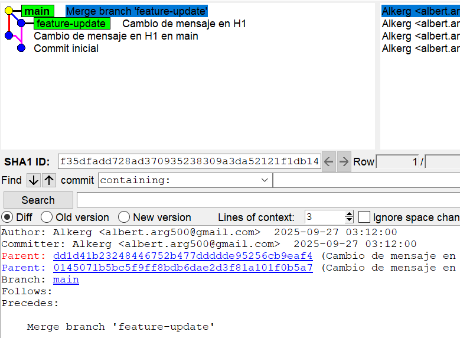

# Actividad 7: Explorando estrategias de fusión en Git

## Ejemplos prácticos (con evidencias)

### 1) Fusión Fast-forward (git merge --ff)

### 2) Fusión No-fast-forward (git merge --no-ff)

### 3) Fusión Squash (git merge --squash)

## Ejercicios guiados

### A) Evitar (o no) --ff

- Ejecuta una fusión FF real (ver 1).
- **Pregunta: ¿Cuándo evitarías --ff en un equipo y por qué?**
Cuando queremos integrar features grandes que interactúan entre sí, es decir no son totalmente independientes y de mediana o gran complejidad porque es muy probable que se generen conflictos y no sea posible hacer un merge fast-forward

### B) Trabajo en equipo con --no-ff

- Crea dos ramas con cambios paralelos y fusiónalas con --no-ff.
- **Preguntas: ¿Qué ventajas de trazabilidad aporta? ¿Qué problemas surgen con exceso de merges?**
En cuanto a trazabilidad los merge no-fast-forward nos permiten saber exactamente que commits se integraron a la rama principal y desde que rama se realizó. Sin embargo, si hay demasiados merge entre ramas se puede dificultar la lectura del historial.

### C) Squash con muchos commits
- Haz 3-4 commits en feature-3 y aplánalos con --squash.
- **Preguntas: ¿Cuándo conviene? ¿Qué se pierde respecto a merges estándar?**
Comviene usar merge --squash cuando la rama que se quiere fusionar continene cambios pequeños y fáciles de integrar a la rama base. Por otro lado se pierde información explícita de la rama desde donde vienen los cambios y la información de los commits intermedios que se aplicaron a la rama base.

## Conflictos reales con no-fast-forward

1. Repo nuevo -> commit inicial con index.html:

2. git checkout -b feature-update

3. git checkout main

4. Fusiona

5. Resuelve eliminando <<<<<<< ======= >>>>>>> e integrando coherentemente.

6. git add index.html && git commit (cierra el merge).

7. Evidencia

### Preguntas

- **¿Qué pasos adicionales hiciste para resolverlo?**
Primero tuve que resolver un conflicto seleccionando que cambios se iban a aplicar en el archivo y cuales no. Finalmente tuve que añadir los cambios a staging y confirmar confirmar los cambios. 
- **¿Qué prácticas (convenciones, PRs pequeñas, tests) lo evitarían?**
Se podrían aplicar PRs antes de cualquier merge para detectar los conflictos a tiempo y resolverlos de forma adecuada.

## Comparar historiales tras cada método
- Fast-forward (first-parent):

- Solo merges (destaca no-ff):

- Vista completa (útil tras squash):

### Preguntas

- **¿Cómo se ve el DAG en cada caso?**
En cuanto a fast-forward no se distingue claramente el merge de la rama feature y cuando se visualiza todo el árbol si se nota dicho merge.
- **¿Qué método prefieres para: trabajo individual, equipo grande, repos con auditoría estricta?**
Para trabajo individual, prefiero usar merge fast-forward ya que los cambios tienden a ser más lineales. Cuando se trata de un equipo grande o un repositorio con auditoría estricta lo ideal es usar merge no-fast-forward ya que hay varios desarrolladores trabajando en distintas ramas a la vez, lo cual puede generar muchos conflictos y también porque es neceario mantener un historial completo de los commits realizados por más pequeños que sean.

## Revertir una fusión (solo si HEAD es un merge commit)

1. Asegura un merge commit reciente (del ejercicio --no-ff).

2. Verifica que HEAD tiene dos padres:

3. Revertir manteniendo la base como mainline / parent primario (#1):

4. Evidencia

### Preguntas
- **¿Cuándo usar git revert en vez de git reset?**
Se debe usar git revert en ramas compartidas ya que mantiene el historial de cambios y reversiones. Por otro lado git reset se debe usar en ramas locales ya que podemos eliminar los commits deseados sin dejar un rastro.
- **¿Impacto en un repo compartido con historial público?**
En un repo compartido se debe mantener un historial intacto por tanto es mejor usar git revert, de ese modo se evitan conflictos con los colaboradores que necesitan aplicar dicha reversión. Si se usara git reset se perdería la información de los commits eliminados y crearía conflictos con los colaboradores que no están al tanto de ello.

## Variantes útiles para DevOps/DevSecOps

### A) Fast-Forward Only (merge seguro)
1. Crea feature-ffonly desde main, añade 1 commit.

2. En main: git merge --ff-only feature-ffonly (debe pasar).

3. Para forzar un fallo didáctico: crea un commit en main tras crear la rama e intenta de nuevo (fallará).

### B) Rebase + FF (historial lineal con PRs)
1. git checkout feature-rebase (con 2-3 commits), actualiza base:

2. Integra

3. git log --graph --oneline --decorate --all --first-parent > evidencias/10-rebase-ff.log

### C) Merge con validación previa (sin commitear)
1. git merge --no-commit --no-ff feature-validate

2. Validaciones reproducibles mínimas (elige según tu proyecto):

3. Si todo ok: git commit

4. Evidencia: git log --graph --oneline --decorate --all > evidencias/11-pre-commit-merge.log

### D) Octopus Merge (varias ramas a la vez)
1. Prepara feat-a, feat-b (commits pequeños, sin tocar mismas líneas).

2. git checkout main && git merge feat-a feat-b

3. Evidencia: git log --graph --oneline --merges --decorate > evidencias/12-octopus.log

### E) Subtree (integrar subproyecto conservando historial)
1. Opción liviana (recomendado): usa un repo mínimo propio para no descargar mucho: git subtree add --prefix=vendor/demo https://github.com/tu-usuario/repo-minimo.git main
2. Sincroniza: git subtree pull --prefix=vendor/demo https://github.com/tu-usuario/repo-minimo.git main
3. Evidencia: git log --graph --oneline --decorate --all > evidencias/13-subtree.log

### F) Sesgos de resolución y normalización (algoritmo ORT)

### G) Firmar merges/commits (auditoría y cumplimiento)
